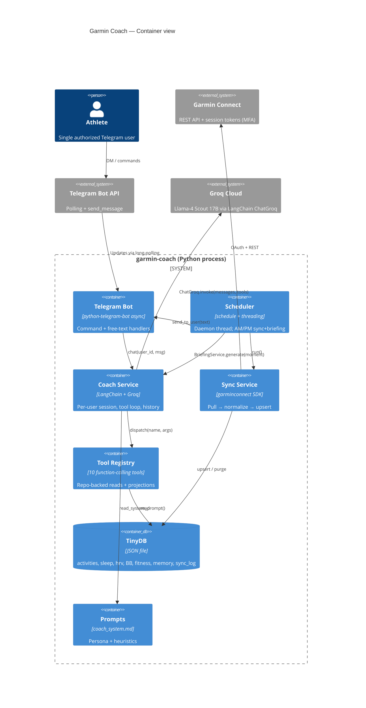
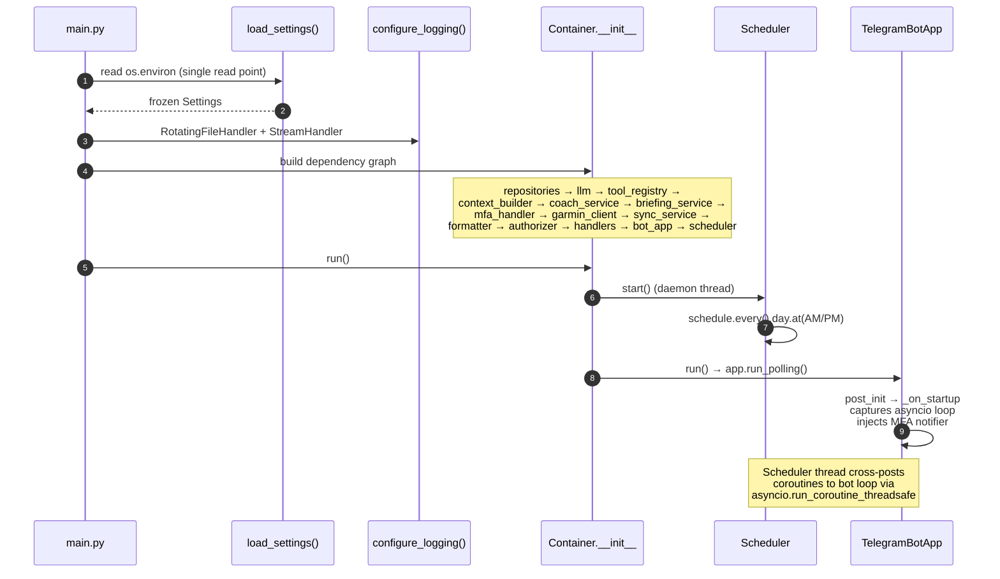
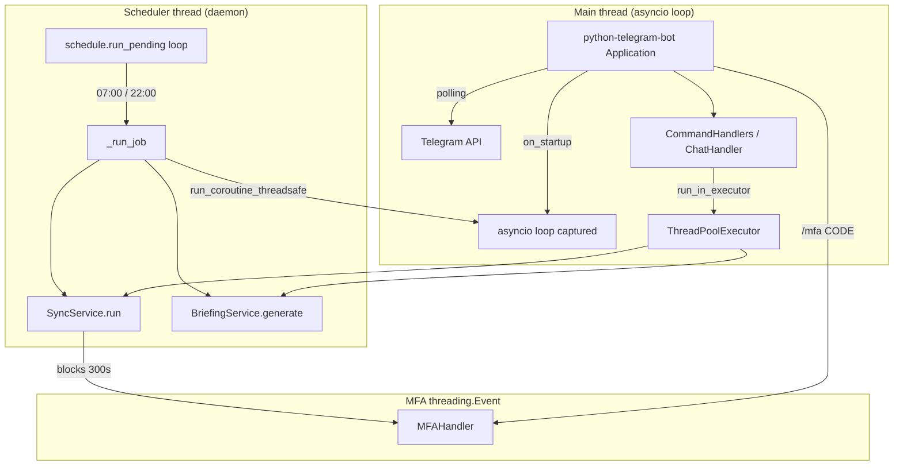
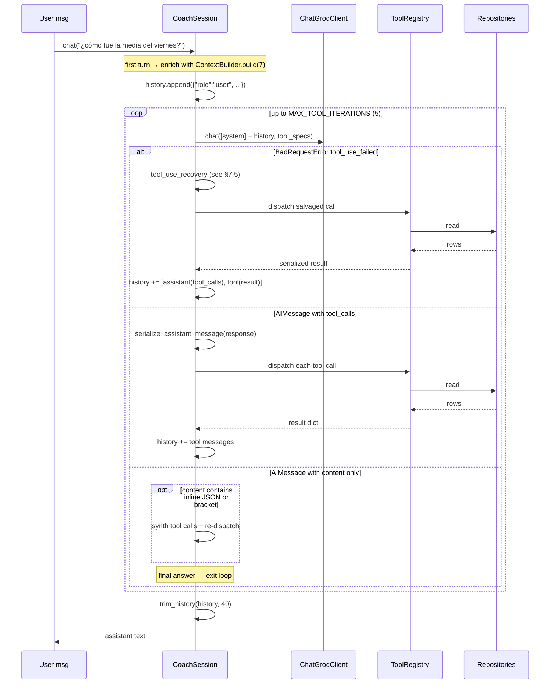
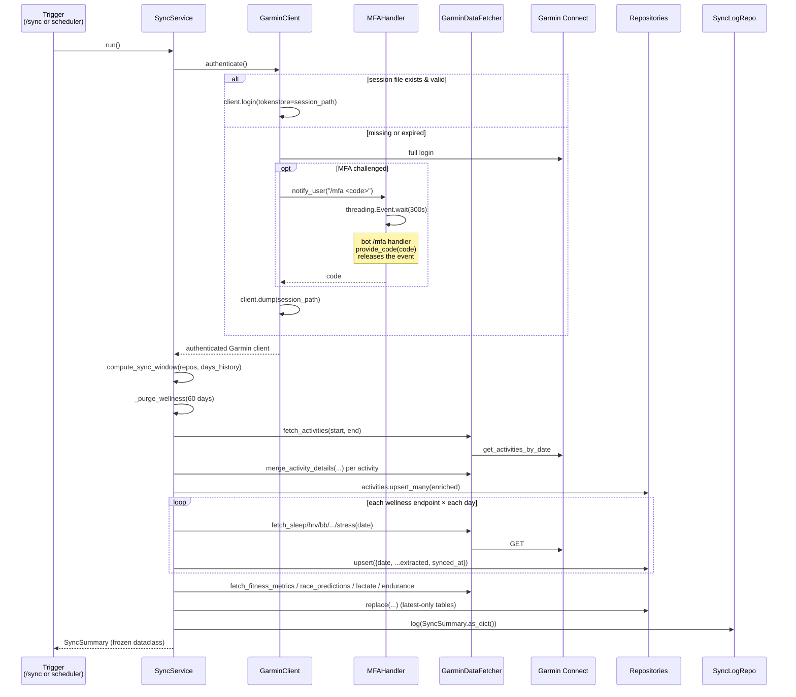
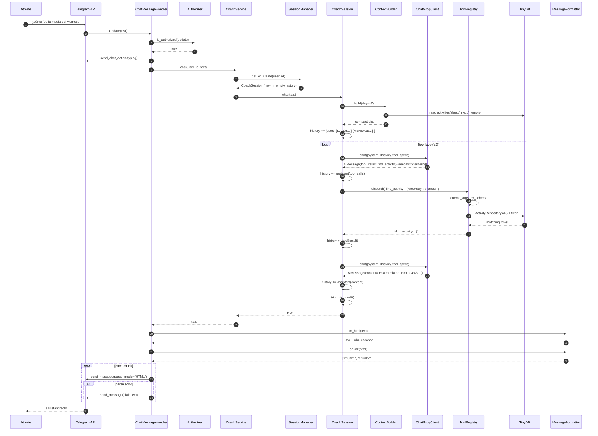

# Garmin Coach — Architecture Deep Dive

> Technical architecture write-up for an in-house developer presentation.
> Audience: engineers. Tone: technical, no marketing fluff.
> First contact with agentic LLM applications (LLM + tools + memory + side-effects).

---

## 1. What this app is

`garmin-coach` is a single-process Python service that turns a Garmin Connect account into a conversational running coach reachable through Telegram. The agent is built on top of **Groq + Llama-4 Scout 17B** via **LangChain (`langchain-groq`)**, with **OpenAI-style function calling** (tool use) wired to a local **TinyDB** snapshot of the athlete's biometric history.

Two concurrent subsystems live in the same Python process:

1. **Telegram bot** — `python-telegram-bot` async polling, main thread.
2. **Scheduler** — `schedule` library, daemon background thread, fires *sync + briefing* twice a day.

Both subsystems share state via a captured `asyncio` event loop (`TelegramBotApp.loop`), used from the scheduler thread via `asyncio.run_coroutine_threadsafe`. **No module-level globals anywhere** — every dependency is wired through a `Container`.

The agentic core consists of:

- A **system prompt** (`prompts/coach_system.md`) defining the persona ("Lobo, coach analítico de running") and analysis rules.
- A **per-user `CoachSession`** holding chat history + running the tool-calling loop.
- A **`ToolRegistry`** with 10 function-calling tools exposing repositories and projections to the LLM.
- A **`ContextBuilder`** that materialises a compact JSON snapshot of the last 7 days, injected on the **first user message of a session** (RAG-lite).
- A robust **tool-use recovery layer** for Llama-4 Scout's malformed function-call dialects.

---

## 2. High-level architecture (C4 — Containers)



---

## 3. Module map

All modules (except `main.py`) live under `garmin_coach/`. Five layers:

| Layer | Path | Responsibility |
|---|---|---|
| `app/` | composition root | `Settings`, `Container`, `Scheduler`, `logging_setup` |
| `domain/` | pure types | `Activity`, `Sleep`, `HRV`, `BodyBattery`, `TrainingStatus`, `Session`, `FitnessMetrics` … (frozen dataclasses + enums) |
| `services/` | business logic | `CoachService`, `CoachSession`, `SessionManager`, `BriefingService`, `SyncService`, `ContextBuilder`, `projections.py`, `tools/` |
| `infrastructure/` | I/O adapters | `db/` (TinyDB), `garmin/` (Garmin SDK + MFA), `telegram/` (bot + handlers + formatter), `llm/` (ChatGroq client + recovery) |
| `prompts/` | text resources | `coach_system.md` (loaded at boot, single source of truth for the persona) |

Strict dependency direction: `domain ← services ← infrastructure ← app`. The composition root (`Container`) is the only place that imports across layers.

---

## 4. Process startup

`main.py` is intentionally minimal (the project enforces "≤20 LOC entry point"):

```python
def main() -> None:
    load_dotenv()
    settings = load_settings()
    configure_logging(settings)
    Container(settings).run()
```

Boot sequence inside `Container`:



### 4.1 `Settings` (`app/config.py`)

Frozen dataclass. `load_settings()` is **the only place in the codebase that reads `os.environ`** — everything else takes a `Settings` instance. Required vars fail-fast with a `RuntimeError` listing every missing one (no partial boot).

Defaults of interest:

```python
timezone:   "Europe/Madrid"
llm_model:  "meta-llama/llama-4-scout-17b-16e-instruct"
db_path:    /data/garmin_coach.json
log_path:   /data/logs/bot.log
sync_time:  07:00 morning, 22:00 evening
```

### 4.2 Logging (`app/logging_setup.py`)

- `RotatingFileHandler` 5 MB × 5 backups on `settings.log_path`.
- `StreamHandler` so `docker logs` still works.
- Noisy libs (`httpx`, `garminconnect`, `urllib3`, `httpcore`) clamped to `WARNING`.
- Convention: `event=<snake_case> key1=val1 key2=val2`. Every external I/O (Garmin call, LLM invoke, TinyDB write, Telegram send) is logged INFO on start + INFO on end with `duration_ms`, ERROR on failure.

### 4.3 `Container` (`app/container.py`)

Manual DI. No framework. The constructor wires everything in topological order; `run()` starts the scheduler then blocks on `bot_app.run()`. Stop is symmetric (`scheduler.stop()` in `finally`).

Key design points:

- Repositories are instantiated **eagerly** but the TinyDB instance itself is lazy through `TinyDBFactory.get()`.
- The system prompt is read **once** (`_get_system_prompt`) and shared by `CoachSession` factory and `BriefingService` via closure capture.
- `CoachService` receives a `SessionManager(_session_factory)` so each new `user_id` gets a fresh `CoachSession` lazily.

---

## 5. Concurrency model



Critical invariants:

- **One asyncio loop** (the bot's). `TelegramBotApp._on_startup` does `self.loop = asyncio.get_running_loop()` and is the only writer.
- Long blocking work inside command handlers (`/sync`, `/briefing`, `/logs`) is offloaded with `await loop.run_in_executor(None, fn, ...)` so the bot stays responsive.
- The scheduler's `_run_job` runs on a **non-async** daemon thread; sending the briefing back to Telegram crosses the boundary via `asyncio.run_coroutine_threadsafe(bot_app.send_to_user(text), loop)`.
- MFA is the only shared mutex: a `threading.Event` blocks Garmin's `prompt_mfa` callback for up to 300s while `/mfa <code>` from Telegram releases it via `MFAHandler.provide_code(code)`.

---

## 6. Telegram bot (`infrastructure/telegram/`)

### 6.1 `TelegramBotApp.build()`

Uses python-telegram-bot v20 builder. Notable knobs:

- `.concurrent_updates(True)` — independent message handling, doesn't serialise users.
- `.post_init(self._on_startup)` — runs after the loop spins up; captures `asyncio.get_running_loop()` and registers the MFA notifier:

```python
def _notifier(message: str) -> None:
    if self.loop and self.loop.is_running():
        asyncio.run_coroutine_threadsafe(
            app.bot.send_message(chat_id=allowed_user_id, text=message),
            self.loop,
        )
self._mfa.set_notifier(_notifier)
```

### 6.2 Handlers

| Handler | Type | What it does |
|---|---|---|
| `/start` | command | Sends the help message. |
| `/sync` | command | Runs `SyncService.run` via `run_in_executor`. |
| `/status` | command | Counts records in TinyDB for the last 7 days. |
| `/briefing` | command | Calls `BriefingService.generate(moment)` (morning if `hour<14`, else evening). |
| `/reset` | command | `CoachService.reset(user_id)` — wipes session history. |
| `/resetsession` | command | `GarminClient.reset()` — deletes persisted Garmin session file. |
| `/mfa <code>` | command | `MFAHandler.provide_code(code)` — releases the blocking sync thread. |
| `/memoria <note>` | command | `MemoryRepository.add(note)` — append-only freeform notes. |
| `/logs [N]` | command | `tail -n N /data/logs/bot.log` in `<pre>` blocks. |
| free text | `MessageHandler(filters.TEXT & ~filters.COMMAND)` | `ChatMessageHandler.handle` → `CoachService.chat`. |

Every handler is gated by `Authorizer.is_authorized(update)` (single-user bot, value of `TELEGRAM_ALLOWED_USER_ID`). Unauthorized → `"No autorizado."`.

### 6.3 Output formatter

`MessageFormatter.to_html()` performs:

1. Strip leading `#…` markdown headers (Telegram HTML has no headings).
2. `html.escape(text, quote=False)` for `<`, `>`, `&`.
3. Convert `**bold**` → `<b>bold</b>`.

`chunk()` splits at the last `\n` before `MAX_CHUNK_LEN=4000` so multi-message responses don't break mid-line. Every send tries `parse_mode="HTML"` first and **falls back to plain text** on parser errors.

---

## 7. The agentic core

This is the part you'll spend most of the presentation on.

### 7.1 LLM client (`infrastructure/llm/groq_langchain.py`)

```python
class ChatGroqClient(LLMClient):
    def __init__(self, model, chat_max_tokens=2400, briefing_max_tokens=2500, temperature=0.85):
        self._chat_client     = ChatGroq(model=model, max_tokens=chat_max_tokens,     temperature=temperature)
        self._briefing_client = ChatGroq(model=model, max_tokens=briefing_max_tokens, temperature=temperature)
```

Two `ChatGroq` instances:

- `_chat_client` — used by `CoachSession`. Token budget bigger so tool-result-laden contexts still fit a useful reply.
- `_briefing_client` — used by `BriefingService` for scheduled summaries (no tools bound, single shot).

`chat(messages, tool_specs)` binds tools at the moment of the call:

```python
client = self._chat_client.bind_tools(tool_specs) if tool_specs else self._chat_client
response = client.invoke(messages)
```

The implementation is the **only** module that imports `langchain_groq`. The `LLMClient` ABC (`infrastructure/llm/base.py`) exposes just `chat(messages, tool_specs=None) -> object` and `briefing(messages) -> str`, which is what every consumer depends on.

Notable: `BadRequestError` from `groq` is **not** caught here — recovery is the session's job (see §7.5).

### 7.2 `CoachSession` (`services/coach_session.py`)

One `CoachSession` per `user_id`, lazily created by `SessionManager`. Holds:

```python
self.history: list[dict]            # OpenAI-format messages (system not included)
self._system_prompt: str
self._max_iterations = 5            # tool loop bound
self._max_history    = 40           # trim window
```

The entry point is `chat(user_message, include_garmin_data=True)`.

#### 7.2.1 First-turn context injection (RAG-lite)

If `history == []` and the caller wants Garmin context (which is the default from Telegram), the user message is **enriched** before being appended to history:

```python
context = self._context_builder.build(days=7)  # compact dict
enriched = (
    f"[DATOS GARMIN ACTUALIZADOS - últimos 7 días, formato compacto]\n"
    f"{json.dumps(context, ensure_ascii=False)}\n\n"
    f"[MENSAJE DEL ATLETA]\n{user_message}"
)
```

This is the cheap RAG: instead of letting the model decide it needs `get_recent_activities` on every turn, we frontload a slimmed snapshot of the last week. Tools are then used for "drill-downs" the snapshot doesn't cover (older windows, specific dates, full activity detail, PRs, memory search).

#### 7.2.2 The tool loop



Pseudo-code of the loop body (`services/coach_session.py:75-203`, paraphrased):

```python
for iteration in range(self._max_iterations):
    messages = [{"role": "system", "content": self._system_prompt}] + self.history
    try:
        response = self._llm.chat(messages, tool_specs=tool_specs)
    except BadRequestError as exc:
        # see §7.5 — try function-tag, inline-JSON, bracket, plain-text salvage
        ...
        continue / break

    self.history.append(serialize_assistant_message(response))
    assistant_message = coerce_content_to_text(response.content)

    tool_calls = normalize_tool_calls(response)        # valid + invalid merged
    if not tool_calls:
        # secondary recovery on content (model emitted tool intent as prose)
        if inline := parse_inline_tool_calls(assistant_message):
            # rewrite last assistant turn as synthetic tool_calls, dispatch, loop
            ...
            continue
        if bracket := parse_bracket_tool_call(assistant_message, registry.known_names()):
            ...
            continue
        break  # genuine final answer

    self.history.extend(self._execute_tool_calls(tool_calls))
else:
    logger.warning("MAX_TOOL_ITERATIONS reached without final answer")

self.history = trim_history(self.history, self._max_history)
return assistant_message
```

Why 5 iterations? Llama-4 Scout via Groq tool-calls cleanly in one or two rounds for almost every question; the bound is a safety net against accidental loops. The warning at iteration cap is observable in logs.

#### 7.2.3 History serialization

`infrastructure/llm/message_helpers.py` contains the three pure helpers the session leans on:

- `coerce_content_to_text(content)` — newer `langchain_groq` returns `content` as a list of typed blocks (`[{"type":"text","text":"..."}]`); this flattens to plain string for our downstream regex parsers.
- `serialize_assistant_message(msg)` — converts a LangChain `AIMessage` (optionally with `tool_calls`) into the OpenAI-style dict the LLM expects back next round.
- `normalize_tool_calls(msg)` — merges `msg.tool_calls` (well-formed) and `msg.invalid_tool_calls` (parser failures, raw string args) into a single `[{id,name,args}]` shape so the executor doesn't care which one it got.
- `trim_history(history, max_len=40)` — keeps the last N entries but **never lets a `role:tool` message become an orphan** (it would 400 if the assistant turn that emitted the `tool_call_id` got trimmed out).

### 7.3 Tool registry (`services/tools/`)

The skeleton is a tiny ABC + a dataclass:

```python
# services/tools/base.py
@dataclass
class ToolResult:
    data: Any = None
    error: str | None = None

class Tool(ABC):
    name: ClassVar[str]
    description: ClassVar[str]
    parameters: ClassVar[dict]   # JSON Schema

    @abstractmethod
    def handle(self, **kwargs) -> ToolResult: ...

    def to_spec(self) -> dict:
        return {
            "type": "function",
            "function": {
                "name": self.name,
                "description": self.description,
                "parameters": self.parameters,
            },
        }
```

The 10 tools wired in `Container._build_tool_registry`:

| Tool | Source | Use case |
|---|---|---|
| `find_activity` | `activity_tools.FindActivityTool` | Filter by weekday (Spanish names), date, distance range, type, only_runs. |
| `get_recent_activities` | `activity_tools.GetRecentActivitiesTool` | N-day window listing, newest first, optional type filter. |
| `get_activity_detail` | `activity_tools.GetActivityDetailTool` | Drill-down by `activityId` (returned by `find_activity`). |
| `get_sleep_window` | `wellness_tools` | Sleep stages, score, RHR for N days. |
| `get_hrv_window` | `wellness_tools` | Daily HRV (lastNight, weeklyAvg, status). |
| `get_body_battery_window` | `wellness_tools` | Body Battery max/min per day. |
| `get_training_readiness_window` | `wellness_tools` | Daily readiness score + breakdown. |
| `get_fitness_snapshot` | `fitness_tools.GetFitnessSnapshotTool` | VO2max + race predictions + lactate threshold + endurance score. |
| `get_personal_records` | `fitness_tools.GetPersonalRecordsTool` | PR computation from activity history. |
| `search_memory` | `memory_tools.SearchMemoryTool` | Free-text search over `/memoria` notes. |

`ToolRegistry.specs()` returns the JSON-Schema array we hand to `ChatGroq.bind_tools(...)`. Each spec is shaped the way Groq's OpenAI-compatible API expects.

#### 7.3.1 Type coercion (Llama quirk)

Llama-4 Scout frequently emits *every* argument as a string — including booleans, integers and floats — and sometimes as the empty string `""` for unset slots. `coerce_args_by_schema(args, schema)` (in `services/tools/registry.py`) walks the JSON Schema for the call and:

- Drops `None` / empty / whitespace strings (so `default` applies).
- Converts numeric strings to `int` or `float` per `schema.type`.
- Converts `"true"/"1"/"yes"/"sí"` and `"false"/"0"/"no"` to `bool`.
- Leaves already-typed values untouched.
- Drops anything that fails conversion (default kicks in).

Without this, half the tool calls would crash with `TypeError` on `int(...)` and the LLM would spiral retrying.

#### 7.3.2 Dispatch

`ToolRegistry.dispatch(name, args)` is **the only place that can crash a tool**, and it doesn't propagate exceptions:

```python
try:
    clean_args = coerce_args_by_schema(args or {}, tool.parameters)
    result = tool.handle(**clean_args)
    if result.error is not None:
        return {"error": result.error}
    return result.data
except TypeError as e:
    return {"error": f"bad arguments for {name}: {e}"}
except Exception:
    logger.exception("event=tool_crashed name=%s", name)
    return {"error": f"{name} failed"}
```

The error dict is JSON-serialised and shipped back to the model as a normal `role:tool` message, which is what lets the conversation continue cleanly after a bad call.

### 7.4 Context builder & projections

The dump injected on the first turn (~7 days of data) is built by `ContextBuilder.build(days=7)`. It pulls every wellness/fitness table for the window and runs each row through a `slim_*` projection (`services/projections.py`). What the LLM gets is **not** the raw Garmin payload — it's a hand-tuned, compact dict roughly an order of magnitude smaller and pre-computed for the units the prompt expects:

- Activities: `duration_hms`, `pace_min_per_km`, `distance_km`, `aerobic_te`, `weekday` (Spanish), `is_run`, `is_long_run`.
- Sleep: `total_h`, `deep_h`, `rem_h`, `awake_h`, `score`, `restingHR`.
- Plus derived signals computed in projections:
  - `notable_runs` — top-3 longest in window.
  - `fastest_runs` — top-3 by best `pace_min_per_km` (min 3 km).
  - `hrv_trend_14d` — linear slope ms/day + categorical direction.
  - `weekly_load` + `acwr` — acute:chronic ratio (7d / mean 28d).
  - `resting_hr_trend` — last-7d mean vs prior-7d.
  - `aggregate_series(field)` — `{last, mean, min, max, n}` summaries.

The prompt is explicit about which fields to read; mismatches between prompt and projection have historically been the #1 source of bugs (hence the `prompt-projection-auditor` subagent).

### 7.5 Tool-use recovery (the messy part)

Llama-4 Scout's tool-call emission via Groq is **not** as reliable as the OpenAI native flow. We see four failure modes in production. All four are recovered in `infrastructure/llm/tool_use_recovery.py` + `services/coach_session.py`:

| Mode | What it looks like | Recovery |
|---|---|---|
| **1. `BadRequestError tool_use_failed` with `<function=...>` tag** | Groq's API rejects the response server-side and returns the raw `failed_generation` string containing something like `<function=find_activity({"days": 7})</function>` | `parse_function_tag(failed)` regex → `(name, args)` → fabricate synthetic `assistant` turn with `tool_calls` + dispatch + append `role:tool`. |
| **2. `BadRequestError` with inline JSON in `failed_generation`** | `[{"name": "find_activity", "parameters": {...}}]` emitted as text | `parse_inline_tool_calls(failed)` balanced-brace JSON extractor → list of `(name, args)` → `_synthesize_inline_tool_calls(...)` |
| **3. `BadRequestError` with `[tool_name]` bracket** | Model writes `[get_recent_activities]` as text | `parse_bracket_tool_call(failed, known_names)` → call with empty args |
| **4. Successful AIMessage, but `tool_calls` is empty and `content` *is* a tool intent** | LLM thinks it called the tool, actually emitted JSON in prose | Same `parse_inline_tool_calls` / `parse_bracket_tool_call` against `assistant_message`; **rewrites** the last assistant entry as `tool_calls`, appends `role:tool`, continues the loop |

When nothing is parseable, `salvage_tool_use_failed(exc)` strips the bogus `<function=...>` tag and returns the remaining prose as a best-effort plain-text answer. If even that's empty, the original `BadRequestError` propagates and the outer `try/except` in `chat()` returns `❌ Error al conectar con el coach: ...` to Telegram (so the user always gets a reply).

Every recovery path logs `logger.warning("event=tool_recovery strategy=...")` so the operator can see how often each mode fires — it's one of the diagnostic signals when changing models.

### 7.6 `BriefingService`

Plain "complete this prompt" path — no tools bound, single LLM call. Reuses the same `ContextBuilder.build(days=7)` snapshot and the **same system prompt**, but with a fixed user message ("Buenos días…" / "Buenas noches…").

```python
result = self._llm.briefing([
    {"role": "system", "content": self._system_prompt},
    {"role": "user",   "content": prompt + json.dumps(context)},
])
```

It pops `race_predictions` from the context first (deliberate scope decision — race predictions are useful in conversation, noise in a morning brief).

---

## 8. Sync pipeline (`services/sync_service.py`)



Key decisions:

- **Incremental window**: `compute_sync_window(repos, default_days)` looks at the latest `date` across repos and pulls only from there forward; on a clean DB it falls back to `DAYS_HISTORY` (default 30).
- **Activity detail merge**: `merge_activity_details` fans out `fetch_activity_detail(activity_id)` for each activity in the window and `dict.update`s the result onto the row before upsert.
- **Retention**: `_purge_wellness(days=60)` removes wellness rows older than 60 days from every wellness table (activities are kept).
- **Latest-only tables**: fitness metrics, race predictions, lactate threshold, endurance score are overwritten with `repo.replace(...)`, not appended — we only ever care about the most recent snapshot.
- **Failure isolation**: each endpoint is wrapped in `try/except` so a single 500 from Garmin doesn't abort the run. `SyncSummary` records actual upsert counts so the operator sees partial successes.

`SyncSummary` is the frozen dataclass returned to callers and persisted to `sync_log`:

```python
@dataclass(frozen=True)
class SyncSummary:
    activities: int
    sleep: int
    hrv: int
    body_battery: int
    training_status: int
    training_readiness: int
    respiration: int
    spo2: int
    stress: int
    fitness_metrics: int
    race_predictions: int
    lactate_threshold: int
    endurance_score: int
    purged: dict
    started_at: str
    finished_at: str
```

---

## 9. Persistence (`infrastructure/db/`)

**TinyDB** — single JSON file, primary key per table:

| Table | PK | Notes |
|---|---|---|
| `activities` | `activityId` (string) | Upserted, no expiry. |
| `sleep`, `hrv`, `body_battery`, `training_status`, `training_readiness`, `respiration`, `spo2`, `stress` | `date` (ISO string) | Upserted; purged after 60 days. |
| `fitness_metrics`, `race_predictions`, `lactate_threshold`, `endurance_score` | `date` | `.replace(row)` — always one row. |
| `memory` | — | Append-only `/memoria` notes. |
| `sync_log` | — | Append-only `SyncSummary` history. |

`TinyDBFactory.get()` is a lazy singleton (creates parent dirs, sets `indent=2, ensure_ascii=False`). `BaseRepository` exposes the standard CRUD: `upsert`, `upsert_many`, `insert`, `find_by_date_range(field, start, end)`, `delete_older_than`, `latest`, `count`, `is_empty`.

Why TinyDB? It's a single-user bot, total payload fits comfortably in JSON, no operational overhead, the file is human-readable for debugging. The trade-off is no concurrent writers — fine because **only** the scheduler thread and the bot main thread write, never in parallel (sync is serialised by the `schedule` library + manual `run_in_executor`).

---

## 10. Where LangChain actually lives

The LangChain footprint is intentionally minimal. The project uses **`langchain-groq` and `langchain-core` only** — no agents, no chains, no memory abstractions, no LCEL.

Concretely:

- `from langchain_groq import ChatGroq` — the chat model wrapper. We use:
  - `ChatGroq(model=..., max_tokens=..., temperature=...)` constructor.
  - `.bind_tools(tool_specs)` — wires OpenAI-format function specs to the model.
  - `.invoke(messages)` — returns an `AIMessage` with `.content`, `.tool_calls` (parsed) and `.invalid_tool_calls` (raw).
- `AIMessage.tool_calls` shape: `[{"id": ..., "name": ..., "args": {...}}]`.

That's it. The **tool loop, history management, context injection, recovery, session lifecycle, error handling — all of that is hand-rolled**. We deliberately did not adopt `langchain.agents.AgentExecutor` or LangGraph because:

1. The agent's behavior is simple enough (one or two tool calls per turn) that a 200-line while loop is easier to reason about than a generic executor.
2. Llama-4 Scout's malformed-call recovery is the messy part, and AgentExecutor doesn't help with that — it would just convert our 4-strategy recovery into 4 patches against opaque internals.
3. Conversation history is just `list[dict]`; we don't need `ConversationBufferMemory`.

In other words: **LangChain is being used as a thin client to Groq's OpenAI-compatible API**. The "agent" loop is ours.

---

## 11. End-to-end: a single chat turn



---

## 12. Failure handling matrix

| Failure | Where caught | What user sees |
|---|---|---|
| Garmin API timeout / 5xx | `GarminDataFetcher._safe` → returns `None` | sync row simply skipped, summary count lower |
| Garmin auth expired | `GarminClient.authenticate` → delete session, full login | transparent unless MFA needed |
| Garmin MFA required | `MFAHandler.notify_user → wait_for_code(300s)` | Telegram message asking for `/mfa <code>` |
| MFA timeout (300s) | `TimeoutError` from `wait_for_code` → bubbles to `cmd_sync` | `❌ Error en sync: MFA code not received within 300s. ...` |
| Groq `BadRequestError tool_use_failed` | `CoachSession.chat` recovery cascade (§7.5) | Usually recovered transparently |
| Tool crash | `ToolRegistry.dispatch` | `{"error": "..."}` returned to LLM → it usually adapts |
| LLM call total failure | `CoachSession.chat` outer `except` | `❌ Error al conectar con el coach: ...` |
| Telegram HTML parse error | per-send `try/except` | Falls back to plain text — message still arrives |
| Briefing scheduler called when no loop yet | `Scheduler._run_job` checks `loop.is_running()` | Logs warning, skips send, doesn't crash |

---

## 13. Testing strategy

- `pytest` in `garmin_coach/tests/` mirrors source layout (`tests/services/`, `tests/services/tools/`, `tests/domain/`, etc.).
- Coverage floor: **85%** (`fail_under = 85` in `pyproject.toml`).
- `main.py` and `tests/` are omitted from coverage. `bot.py`-equivalent (`bot_app.py` + handlers) is partially excluded — the safety net there is a dedicated `telegram-handler-reviewer` subagent.
- Tool tests live next to tool impls and run the full registry coercion → dispatch path with mock repos.

---

## 14. Deployment

```bash
cd docker && docker-compose up -d --build
cd docker && docker-compose logs -f
make hard-restart   # down + rebuild + up
```

The container mounts `/data` (host) for TinyDB JSON, Garmin session tokens, and rotating logs. Single container, single process, single user — no orchestration, no sidecar.

---

## 15. Talking points for the presentation

If you only have 30 minutes:

1. **Why an agent vs. a chat completion**: the tool calls are how the LLM gets fresh, structured data it cannot have memorised — without them, the model can only summarise the 7-day frontloaded snapshot. With them, it can drill into any day, any activity ID, run PR queries, search memory.
2. **The hand-rolled loop**: walk through `coach_session.py:75-203` line by line. Five iterations, three failure modes recovered, history trimming respecting tool-call cohesion.
3. **The cost of using a cheap model**: tool-use recovery in `tool_use_recovery.py` exists *only* because Llama-4 Scout via Groq isn't as obedient as OpenAI's tool calls. Show one of the `<function=...>` failures and the regex that salvages it. This is a real-world tax on going off the "happy path".
4. **The projection layer is half the agent**: explain `slim_activity`, `notable_runs`, `weekly_load`, `acwr`. Without projections, the model would consume the raw Garmin dump (1-2 orders of magnitude bigger) and would still need to compute pace from m/s, which it does badly.
5. **Concurrency boundary**: scheduler thread → `asyncio.run_coroutine_threadsafe` → bot loop → Telegram. MFA is the only inter-thread mutex (`threading.Event`).
6. **No framework lock-in**: LangChain is one import (`ChatGroq`), the agent loop is ~200 lines, swapping providers means rewriting `groq_langchain.py` and keeping everything else.

---

## 16. Files worth opening live during the talk

| File | Why |
|---|---|
| `main.py` | Smallest entry point in the repo. |
| `garmin_coach/app/container.py` | The full dependency graph, hand-wired. |
| `garmin_coach/services/coach_session.py` | The agent loop — the heart of the talk. |
| `garmin_coach/services/tools/registry.py` | `coerce_args_by_schema` is the "real talk" about LLM ergonomics. |
| `garmin_coach/infrastructure/llm/tool_use_recovery.py` | The "what could go wrong" exhibit. |
| `garmin_coach/services/projections.py` | Where domain knowledge becomes LLM context. |
| `garmin_coach/prompts/coach_system.md` | The persona contract. Worth reading aloud. |
| `garmin_coach/app/scheduler.py` | The cross-thread plumbing. |
